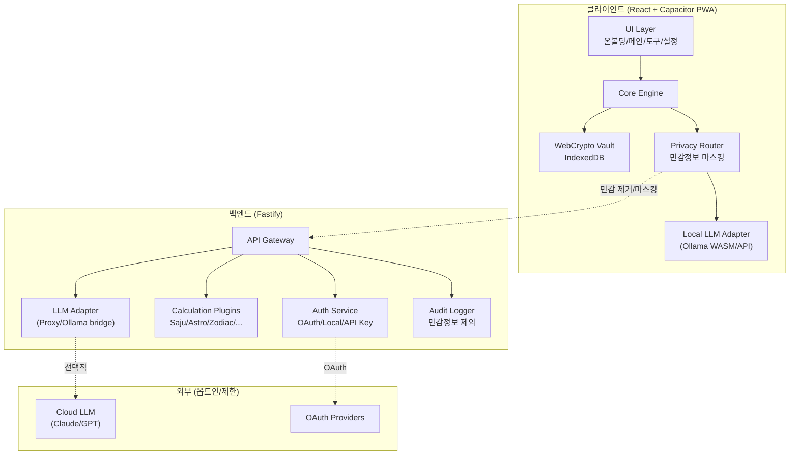
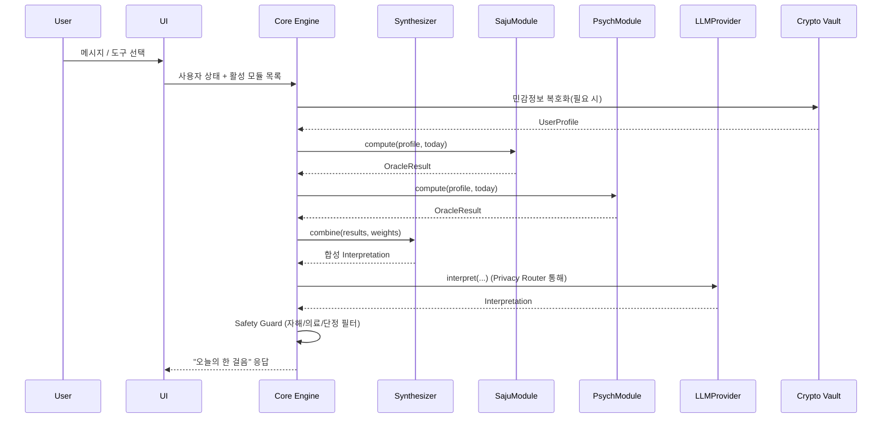
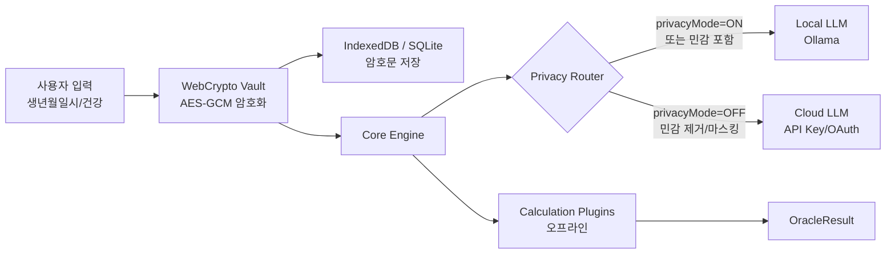

# 아키텍처 & 데이터 설계 (Architecture & Data Design)

> 문서 버전: 0.1 (단계 2 산출물) 기준: 단계 1 산출물 + 설계 명세 2장, 4장

## 1. 설계 원칙

| 원칙 | 설명 |
| --- | --- |
| **코어 수정 금지** | 새로운 OracleModule은 `plugins/` 폴더에 추가하고, 코어는 manifest 기반으로 자동 등록·조합한다. |
| **프라이버시 우선** | 생년월일시·건강정보 등 민감정보는 클라이언트에서 암호화, 클라우드 전송 최소화. 프라이버시 모드 ON 시 클라우드 LLM으로 절대 라우팅되지 않는다. |
| **배포 타깃 게이팅** | `DEPLOY_TARGET=private|public` 빌드 플래그로 기능/보안 기본값을 분리한다. |
| **오프라인 우선** | 핵심 계산(사주/별자리)은 클라이언트/서버 모두 오프라인 동작 가능하도록 한다. |
| **안전 분리** | 위기 감지·의료 경계 가드는 LLM 응답 후처리뿐 아니라 코어 레이어에서도 강제한다. |

---

## 2. 기술 스택 (단계 1 권장안 확정)

| 영역 | 선택 | 근거 |
| --- | --- | --- |
| 프런트엔드 | React 18 + TypeScript + Vite | 반응형, PWA, 모바일 크로스 기반 |
| 모바일 크로스 | Capacitor | 동일 웹 코드베이스, PWA와 빌드 파이프라인 공유 |
| 백엔드 | Node.js + TypeScript + Fastify | 풀스택 타입 공유, 경량 고성능, LLM 클라이언트 생태계 풍부 |
| 상태 관리 | Zustand(클) / 직접 DI(서) | 단순, 지속 가능 |
| 저장소(클) | IndexedDB + WebCrypto(PBKDF2/AES-GCM) | 로컬 우선 암호화, PWA 지원 |
| 저장소(서) | SQLite(개인서버) / PostgreSQL(확장) | 배포 간편, 마이그레이션 용이 |
| 인증 | 1단계: 로컬 계정(PIN/비밀번호) + API 키; 2단계: OAuth(구글/애플) | 개인서버는 외부 의존 최소화 |
| LLM | LLMProvider 추상화 | Ollama(로컬), 사용자 API 키(클라이언트), OAuth 클라우드 |
| 계산 엔진 | 자체 구현 + `kor-lunar` + `astronomia` | KASI 데이터, MIT 라이선스 |
| 배포 | Docker Compose + Caddy | 자동 HTTPS, 리버스프록시, 개인서버용 |
| 테스트 | Vitest(단위), Playwright(E2E), OWASP ZAP/인젝션 시나리오(보안) | 계산/안전/E2E 커버리지 |

---

## 3. 시스템 구조 다이어그램



---

## 4. 모듈 경계

### 4.1 클라이언트 모듈

| 모듈 | 책임 | 중요 제약 |
| --- | --- | --- |
| `ui` | 화면, 접근성, 다크/라이트/야간 모드 | 비즈니스 로직 없음, 코어/스토어에 위임 |
| `core` | 도구 조합(Synthesizer), 상태 판별, 프라이버시 라우팅 | OracleModule 인터페이스에만 의존 |
| `crypto-vault` | 민감정보 암호화/복호화, 키 파생 | WebCrypto API만 사용, 평문 노출 금지 |
| `local-llm` | Ollama 로컬 호스트 연결, 프라이버시 모드 기본 경로 | 클라우드로 전송되지 않음 |
| `plugins-client` | 각 OracleModule의 클라이언트 UI/계산 구현 | 코어 수정 없이 추가 가능 |

### 4.2 서버 모듈

| 모듈 | 책임 | 중요 제약 |
| --- | --- | --- |
| `api-gateway` | 인증, 요청 검증, 라우팅 | 민감정보 로깅 금지 |
| `auth-service` | 로컬 계정, API 키 보관(암호화), OAuth 연동 | 키는 클라이언트 암호화 상태로 저장 권장 |
| `calc-engine` | 만세력/별자리/띠 등 결정적 계산 | 무상태, 골든 테스트 통과 |
| `llm-adapter` | LLMProvider 서버 어댑터, 프록시, 요청 캐시 | 프라이버시 모드 요청 차단 |
| `audit-logger` | 비민감 사용 로그, 오류, 성능 | 민감정보 필터링 |

---

## 5. 플러그인 아키텍처: OracleModule

### 5.1 인터페이스 명세

```typescript
// plugins/oracle-module.types.ts

export type TrustTier = 'verified' | 'conventional' | 'caution';
export type Category = 'fate' | 'psychology' | 'health' | 'ritual';
export type AdviceMode = 'panic' | 'withdrawn' | 'indecisive' | 'reinforce';

export interface InputField {
  key: string;
  label: string;
  type: 'date' | 'time' | 'select' | 'text' | 'boolean' | 'location';
  required: boolean;
  options?: string[];
  sensitive?: boolean; // true면 로컬 암호화 + 클라우드 차단
}

export interface InputSpec {
  fields: InputField[];
}

export interface UserProfile {
  userId: string;
  nickname: string;
  birthDate?: Date;       // 양력 기준
  lunarBirthDate?: Date;  // 음력
  birthTime?: string;     // "01:45" 또는 "unknown"
  birthLocation?: { lat: number; lng: number; name: string };
  gender?: 'male' | 'female';
  mbti?: string;
  bloodType?: string;
  healthContexts?: string[]; // 옵트인, 민감
}

export interface DayContext {
  today: Date;
  timezone: string;
  lunarDate?: Date;
  currentYear: number;
}

export interface EvidenceRef {
  source: string;         // "kor-lunar", "KASI", "CBT manual", ...
  trustTier: TrustTier;
  url?: string;
  note?: string;
}

export interface OracleResult {
  moduleId: string;
  computedAt: string;     // ISO
  data: Record<string, unknown>;
  raw?: Record<string, unknown>; // 디버그/검증용
}

export interface Interpretation {
  summary: string;
  reframe: string;        // 자기이해 언어로 재구성
  oneStep: string;        // 필수: 오늘의 한 걸음
  evidence: EvidenceRef[];
  cautions?: string[];
}

export interface OracleModule {
  id: string;             // "saju" | "tarot" | "astrology" | ...
  title: string;
  category: Category;
  trustTier: TrustTier;
  inputSpec: InputSpec;

  // 결정적 계산 (UI/오프라인 모두 가능)
  compute(input: UserProfile, ctx: DayContext): OracleResult;

  // 해석 생성: 계산 결과 + 모드 + LLM
  interpret(
    result: OracleResult,
    mode: AdviceMode,
    llm: LLMProvider,
    options?: { privacyMode: boolean }
  ): Promise<Interpretation>;
}
```

### 5.2 모듈 등록/조합 흐름



### 5.3 새 모듈 추가 증명

새로운 도구(예: `iching`)를 추가할 때 필요한 작업:

1. `plugins/iching/index.ts`에 `OracleModule` 구현
2. `plugins/iching/manifest.json`에 id/title/category/trustTier 등록
3. `plugins/index.ts`에 import 추가 (단, 이 파일은 자동 생성/scan 가능)

코어 수정 없이 추가 가능한 이유:

- `Core Engine`은 `OracleModule[]` 배열을 주입받음
- `Synthesizer`는 `id` + `trustTier`만 알고 조합
- UI는 `inputSpec`을 기반으로 동적 폼 생성

---

## 6. LLM 추상화: LLMProvider

### 6.1 인터페이스 명세

```typescript
// llm/llm-provider.types.ts

export interface LLMMessage {
  role: 'system' | 'user' | 'assistant';
  content: string;
}

export interface LLMOptions {
  temperature?: number;
  maxTokens?: number;
  timeoutMs?: number;
  privacyMode?: boolean; // true면 이 요청은 로컬 LLM만 가능
}

export interface LLMUsage {
  promptTokens: number;
  completionTokens: number;
  estimatedCostUsd?: number;
}

export interface LLMResponse {
  text: string;
  usage: LLMUsage;
  provider: string;
  model: string;
  routedLocally: boolean;
}

export interface LLMProvider {
  readonly id: string;
  readonly name: string;
  readonly supportsPrivacyMode: boolean;

  chat(messages: LLMMessage[], options?: LLMOptions): Promise<LLMResponse>;
  getCostEstimate(messages: LLMMessage[], options?: LLMOptions): Promise<LLMUsage>;
}
```

### 6.2 Privacy Router

```typescript
// core/privacy-router.ts

export function routeLLM(
  providers: LLMProvider[],
  messages: LLMMessage[],
  options: LLMOptions,
  profile: UserProfile
): Promise<LLMResponse> {
  const hasSensitive = messages.some(m => containsSensitive(m.content, profile));

  if (options.privacyMode || hasSensitive) {
    const local = providers.find(p => p.supportsPrivacyMode);
    if (!local) throw new PrivacyError('프라이버시 모드 사용 가능한 로컬 LLM이 없습니다.');
    return local.chat(messages, { ...options, privacyMode: true });
  }

  const selected = providers.find(p => p.id === userSelectedProviderId);
  return selected.chat(messages, options);
}
```

**민감정보 클라우드 유출 방지 설계 증명:**

- `containsSensitive()`는 생년월일시, 출생지, 건강 키워드, UserProfile 필드 등을 검사
- 프라이버시 모드 ON 시 로컬 LLM 외 모든 provider 차단
- 네트워크 테스트: `privacyMode=true`일 때 외부 호스트로의 HTTP 요청 0건
- 민감정보 마스킹: 클라우드로 보낼 경우(사용자 명시 동의 시) 생년월일시 → "어린 시절", 건강 → "건강 관심사" 등 범주화

### 6.3 구현체 예시

| Provider | ID | supportsPrivacyMode | 특징 |
| --- | --- | --- | --- |
| OllamaLocal | `ollama` | true | http://localhost:11434, Qwen/Gemma 등 |
| UserApiKeyOpenAI | `openai-user` | false | 사용자가 입력한 키, 클라이언트 암호화 저장 |
| UserApiKeyAnthropic | `anthropic-user` | false | 사용자가 입력한 키 |
| OAuthCloud | `oauth-cloud` | false | 향후 OAuth 연동 placeholder |

---

## 7. 데이터 스키마

### 7.1 핵심 엔티티

```typescript
// schema/core.ts

export interface EncryptedField {
  iv: string;        // base64
  ciphertext: string; // base64
  salt: string;      // base64
  version: number;
}

export interface User {
  id: string;
  nickname: string;
  authMethod: 'local' | 'oauth' | 'apikey';
  createdAt: string;
  updatedAt: string;
  // 민감 필드는 암호화
  profileEncrypted: EncryptedField;
}

export interface UserProfileData {
  birthDate?: string;          // ISO date
  birthTime?: string | 'unknown';
  birthLocation?: { lat: number; lng: number; name: string };
  gender?: 'male' | 'female';
  lunarBirthDate?: string;
  isLeapMonth?: boolean;
  mbti?: string;
  bloodType?: string;
  healthContexts?: string[];
}

export interface UserSettings {
  userId: string;
  activeModules: string[];              // ["saju", "psych", "tarot"]
  moduleWeights: Record<string, number>; // { saju: 60, psych: 30, astro: 10 }
  privacyMode: boolean;
  preferredLLM: string;                 // "ollama" | "openai-user" | ...
  llmOptions: {
    localModel: string;                 // "qwen2.5:14b"
    apiKeyEncrypted?: EncryptedField;
  };
  crisisRegion: string;                 // "KR"
  theme: 'light' | 'dark' | 'night-soothing';
  reducedMotion: boolean;
  onboardingDone: boolean;
}

export interface SessionMessage {
  id: string;
  role: 'user' | 'assistant' | 'system' | 'safety';
  content: string;
  mode?: AdviceMode;
  moduleIds?: string[];
  crisisDetected?: boolean;
  createdAt: string;
}

export interface Session {
  id: string;
  userId: string;
  title: string;
  messages: SessionMessage[];
  createdAt: string;
  updatedAt: string;
}

export interface OracleCache {
  userId: string;
  moduleId: string;
  dateSeed: string;          // "2026-06-17"
  timezone: string;
  resultHash: string;        // SHA-256 of inputs
  result: OracleResult;
  expiresAt: string;
}

export interface AuditEvent {
  id: string;
  userIdHash: string;        // 민감정보 제외, 사용자 식별용 해시
  eventType: 'login' | 'compute' | 'llm_call' | 'privacy_block' | 'crisis_detect' | 'delete';
  metadata: Record<string, unknown>; // 민감정보 제외
  createdAt: string;
}
```

### 7.2 민감정보 분류

| 민감도 | 필드 | 처리 |
| --- | --- | --- |
| 높음 | 생년월일시, 출생지 좌표, 건강정보, API 키 | WebCrypto AES-GCM 암호화, IndexedDB/DB에 암호문 저장 |
| 중간 | MBTI, 혈액형, 별자리 | 설정에 따라 암호화, 기본은 암호화 |
| 낮음 | 닉네임, 설정값, 세션 메시지(민감 제외) | 평문 저장 가능하나 세션은 권장 암호화 |

---

## 8. 보안 경계 & 배포 타깃 게이팅

### 8.1 배포 타깃별 기능 분리

| 기능 | `DEPLOY_TARGET=private` | `DEPLOY_TARGET=public` |
| --- | --- | --- |
| 로컬 파일 실험 기능 | 허용 | 금지 |
| API 키 직접 입력 | 허용 | 제한(검토 필요) |
| 사용자 데이터 동기화 | 옵트인 | 기본 옵트아웃 |
| 안전 기본값 | 일반 | 보수적(미성년자 정책 강화) |
| LLM 기본 경로 | 로컬 우선 | 로컬 우선 + 명시적 동의 |
| 로그 수준 | verbose | minimal |

### 8.2 기능 게이트 예시

```typescript
// config/deploy-target.ts
export const DEPLOY_TARGET = (import.meta.env.DEPLOY_TARGET ?? 'private') as 'private' | 'public';

export const FEATURES = {
  localFileExperiment: DEPLOY_TARGET === 'private',
  apiKeyInput: DEPLOY_TARGET === 'private' || import.meta.env.PUBLIC_ALLOW_API_KEY === 'true',
  conservativeSafetyDefaults: DEPLOY_TARGET === 'public',
} as const;
```

---

## 9. 위협 모델 (STRIDE 약식)

| 위협 | 대상 | 설계 대응 |
| --- | --- | --- |
| **S**poofing (인증 위조) | 로컬 계정, OAuth | bcrypt/Argon2, JWT 짧은 만료, OAuth state 검증 |
| **T**ampering (변조) | 계산 결과, 설정, 프롬프트 | 결과 해시 검증, 서명/검증, 시스템 프롬프트 분리 |
| **R**epudiation (부인) | 위기 감지, 데이터 삭제 | AuditEvent 로깅, 민감정보 제외 |
| **I**nformation Disclosure (정보 유출) | 민감정보, API 키 | WebCrypto 암호화, Privacy Router, 민감정보 마스킹 |
| **D**enial of Service | LLM 호출, 계산 엔진 | Rate limit, 캐시, 타임아웃, 비용 상한 |
| **E**levation of Privilege | 관리자 기능, 빌드 플래그 | 기능 게이트, 환경 변수 보호, 최소 권한 |

### 9.1 프라이버시 데이터 흐름도



---

## 10. 핵심 설계 질문에 대한 답변

### Q1. 새 도구 모듈을 코어 수정 없이 추가 가능한가?

**예.**

- `OracleModule` 인터페이스를 구현하는 것만으로 등록 가능
- `Synthesizer`는 `id`/`trustTier`/`evidence`를 기준으로 조합
- UI는 `inputSpec`으로 동적 폼 생성
- 등록은 `plugins/index.ts` import 또는 manifest scan으로 처리

### Q2. 민감정보가 클라우드로 새지 않는 경로가 보장되는가?

**예.**

- `Privacy Router`가 `privacyMode` 또는 민감정보 포함 여부를 강제
- `supportsPrivacyMode=true`인 provider만 프라이버시 모드에서 선택 가능
- 클라우드로 보낼 경우 `sanitizeSensitive()`로 생년/지역/건강 마스킹
- 네트워크 테스트로 `privacyMode=true` 시 외부 호스트 요청 0건 검증

---

## 11. 다음 단계(단계 3) 계획

- `kor-lunar` + `astronomia` 설치 및 만세력 엔진 구현
- 골든 케이스(1980-03-19 01:45 대구 남) 단위 테스트 작성
- 절기/자시/지역시/서머타임 경계 테스트 추가
- 별자리/띠/토정비결 계산 엔진 구현